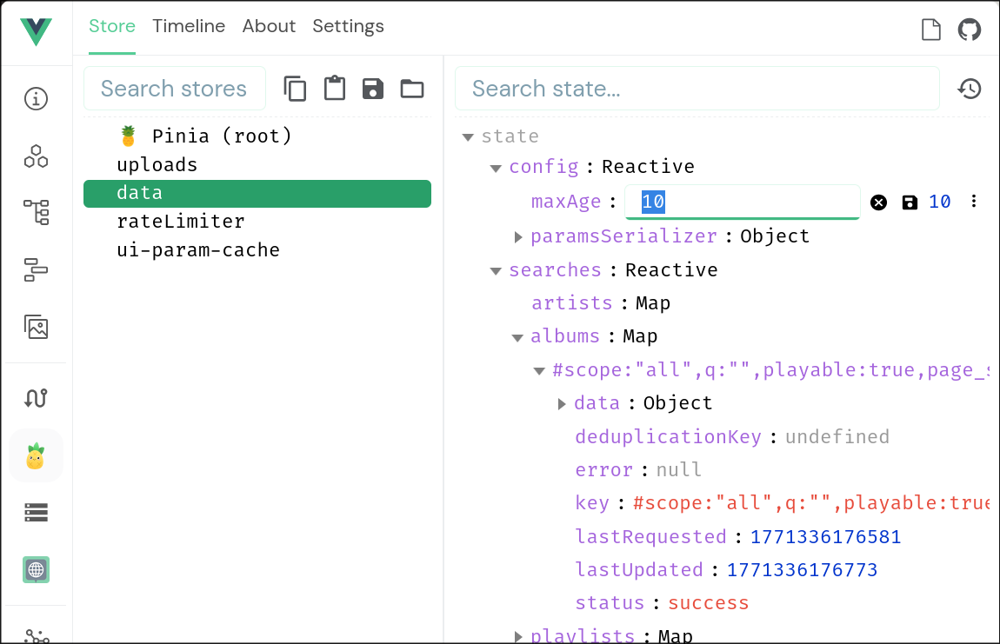
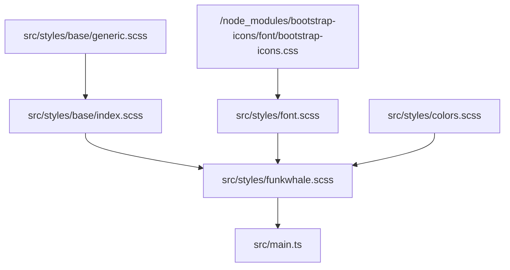
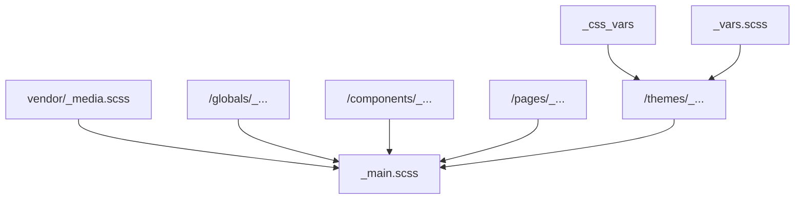

# Contribute to the frontend

The Funkwhale frontend is a {abbr}`SPA (Single Page Application)` written in [Typescript](https://typescriptlang.org) and [Vue.js](https://vuejs.org).

## Troubleshooting

### Network errors (405 and 404) in the console

If you are using Google Chrome, you may have to disable the network cache:

- Go to the Dev Tools
- Select the Network tab
- In the toolbar under the Network tab, activate the checkmark "Disable Cache"

### Edits don't appear when I check them in the browser

Reload the page with `Ctrl+Shift+R` (Mac: `Cmd+Shift+R`)

Make sure you have no add-ons in your browser that mess with the DOM. The best way to check is to open a private window/tab with `Ctrl/Cmd+Shift+P` (Firefox)

## Data requests

Use the Vue DevTools in your browser to inspect the Rate limiter and the Data cache live and to change options such as rate limit or cached resources' maximum age.

See the comments in the store modules for a complete feature documentation.

### Cache

**[`data.ts` store - Cache and deduplicate Funkwhale objects](https://dev.funkwhale.audio/funkwhale/funkwhale/-/blob/develop/front/src/ui/stores/data.ts?ref_type=heads)**



It is currently not possible to completely disable the cache, but you can force cache invalidation by lowering the `maxAge`. Whenever a frontend component requests a data object, and the cached result is older, this will force a re-fetch.


To observe the changes in the cache live, [slow down the rate limiter](rate-limiter) and then switch to the `pinia/data/getters` view in the DevTools.

### Rate limiter

**[`rateLimiter.ts` store - Limit the frequency of API calls; prioritize and cancel requests](https://dev.funkwhale.audio/funkwhale/funkwhale/-/blob/158e80cb69e443751b5378743188e6649e87e79c/front/src/ui/stores/rateLimiter.ts)**


Disable the rate limiter to make the frontend fetch all resources the moment they are requested by any frontend component.

Increase the cooldown time to observe how requests enter and exit the queue.

## Styles

<--! TODO: Mermaid diagrams -->

### UI styles



### App styles



## Components

Start the **UI Live Docs** (vitepress) and follow the link:

```sh
yarn dev:docs
```

- Example: [Button component in the live docs](http://localhost:5173/components/ui/button)

- Find more details about the UI library and [how to contributein the live docs](http://localhost:5173/contributing)

<!-- prettier-ignore-start -->

(testing)=
## Testing

<!-- prettier-ignore-end -->

### Unit tests

The Funkwhale frontend contains some tests to catch errors before changes go live. The coverage is still fairly low, so we welcome any contributions.

To run the test suite, run the following command:

```sh
docker compose run --rm front yarn test:unit
```

To run tests as you make changes, launch the test suite with the `-w` flag:

```sh
docker compose run --rm front yarn test:unit -w
```

### End-to-end testing and User testing

In addition, there are End-to-end tests (cyprus), and we are planning to do User tests in 2025.
