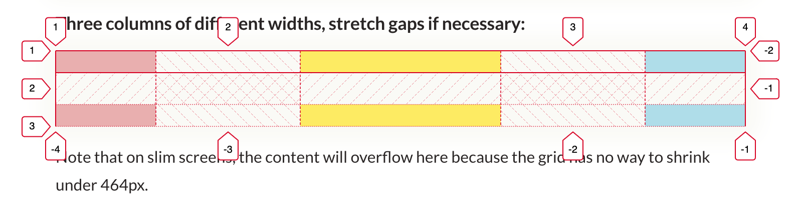

<script setup>
import { ref } from 'vue'

import Card from '~/components/ui/Card.vue'
import Alert from '~/components/ui/Alert.vue'
import Layout from '~/components/ui/Layout.vue'
import Spacer from '~/components/ui/Spacer.vue'
import Tab from '~/components/ui/Tab.vue'
import Tabs from '~/components/ui/Tabs.vue'
import Toggle from '~/components/ui/Toggle.vue'
import Button from '~/components/ui/Button.vue'

const isGrowing = ref(true)
const noGap = ref(true)
</script>

🡔 [Layout](../layout)

# Layout `grid`

Align items both vertically and horizontally.
You can either specify the column width (default: 320px) or set the desired number of columns.

### Override the `column-width` (in px)

_Note that we set the width to match 2 columns plus one gap._

<Layout flex>

```vue-html{2}
<Layout grid
  column-width="90px"
  :width="`${2 * 90 + 32}px`"
>
  <Alert yellow />
  <Card auto title="90px" />
  <Alert blue />
</Layout>
```

<Layout grid column-width="90px" class="preview" :width="`${2 * 90 + 32}px`">
  <Alert yellow />
  <Card auto title="90px" />
  <Alert blue />
</Layout>

</Layout>

### Let elements span multiple rows, columns, or areas

```vue-html{1,2}
  <Alert purple style="grid-column: span 5;" />
  <Alert green style="grid-row: span 2;" />
  <Card title="2"/>
  <Card title="1" />
```

<Layout grid>
  <Alert purple style="grid-column: span 5;" />
  <Alert green style="grid-row: span 2;" />
  <Card title="2"/>
  <Card title="1" />
</Layout>

You can also span an element to a rectangle of multiple columns and rows, in the format `<row-start> / <column-start> / <row-end> / <column-end>`:

```vue-html
<Layout grid="auto / repeat(5, min-content)">
  <Card auto title="A" />
  <Card auto title="B" />
  <Card auto title="C" />
  <Card auto title="D" style="grid-area: 2 / 1 / 4 / 5;" />
  <Card auto title="E" />
  <Card auto title="F" />
  <Card auto title="G" />
  <Card auto title="H" />
  <Card auto title="I" />
</Layout>
```

<Layout grid="auto / repeat(5, min-content)">
  <Card auto title="A" />
  <Card auto title="B" />
  <Card auto title="C" />
  <Card auto title="D" style="grid-area: 2 / 1 / 4 / 5;" />
  <Card auto title="E" />
  <Card auto title="F" />
  <Card auto title="G" />
  <Card auto title="H" />
  <Card auto title="I" />
</Layout>

### Custom grid configuration

You can pass any valid CSS `grid` value to the `grid` prop.

#### Minimal width, fit as many as possible on one row

```vue-html
<Layout grid="auto / repeat(auto-fit, minmax(max-content, 200px))">
  <Alert green />
  <Alert red>Very long text that will force other items to wrap</Alert>
  <Alert blue />
  <Alert yellow />
  <Alert purple />
</Layout>
```

<Layout class="preview" grid="auto / repeat(auto-fit, minmax(max-content, 200px))">
  <Alert green />
  <Alert red>Very long text that will force other items to wrap</Alert>
  <Alert blue />
  <Alert yellow />
  <Alert purple />
</Layout>

#### Up to 2 in a row, between 230-x and 300px

```vue-html
<Layout no-gap
  grid="auto / repeat(auto-fit, minmax(230px, min(50%, 300px)))"
```

<Layout class="preview" no-gap grid="auto / repeat(auto-fit, minmax(230px, min(50%, 300px)))">
  <Alert red />
  <Alert yellow />
  <Alert blue />
</Layout>

#### Up to 5 in a row, between 230-x and 300px

```vue-html
<Layout no-gap
  grid="auto / repeat(auto-fit, minmax(120px, min(20%, 130px)))"

```

<Layout class="preview" no-gap grid="auto / repeat(auto-fit, minmax(120px, min(20%, 130px)))">
  <Alert red />
  <Alert yellow />
  <Alert blue />
  <Alert red />
  <Alert yellow />
  <Alert blue />
</Layout>

#### As many as fit, at least 100px, stretch them if necessary

```vue-html
<Layout
  grid="auto / repeat(auto-fit, minmax(100px, 2fr))"
```

<Layout class="preview" grid="auto / repeat(auto-fit, minmax(100px, 2fr))">
  <Alert red />
  <Alert yellow />
  <Alert blue />
  <Alert red />
  <Alert yellow />
  <Alert blue />
</Layout>

#### Three columns of different widths, stretch gaps if necessary

```vue-html
<Layout
  grid="auto / 100px 200px 100px"
  style="justify-content: space-between"
```

<Layout class="preview" grid="auto / 100px 200px 100px" style="justify-content:space-between">
  <Alert red />
  <Alert yellow />
  <Alert blue />
  <Alert red />
  <Alert yellow />
  <Alert blue />
</Layout>

Note that on slim screens, the content will overflow here because the grid has no way to shrink under 464px.

### Debugging Layouts

The browser's devtools can visualize the components of a grid.



And read [the illustrated overview of all grid properties on css-tricks.com](https://css-tricks.com/snippets/css/complete-guide-grid/).
