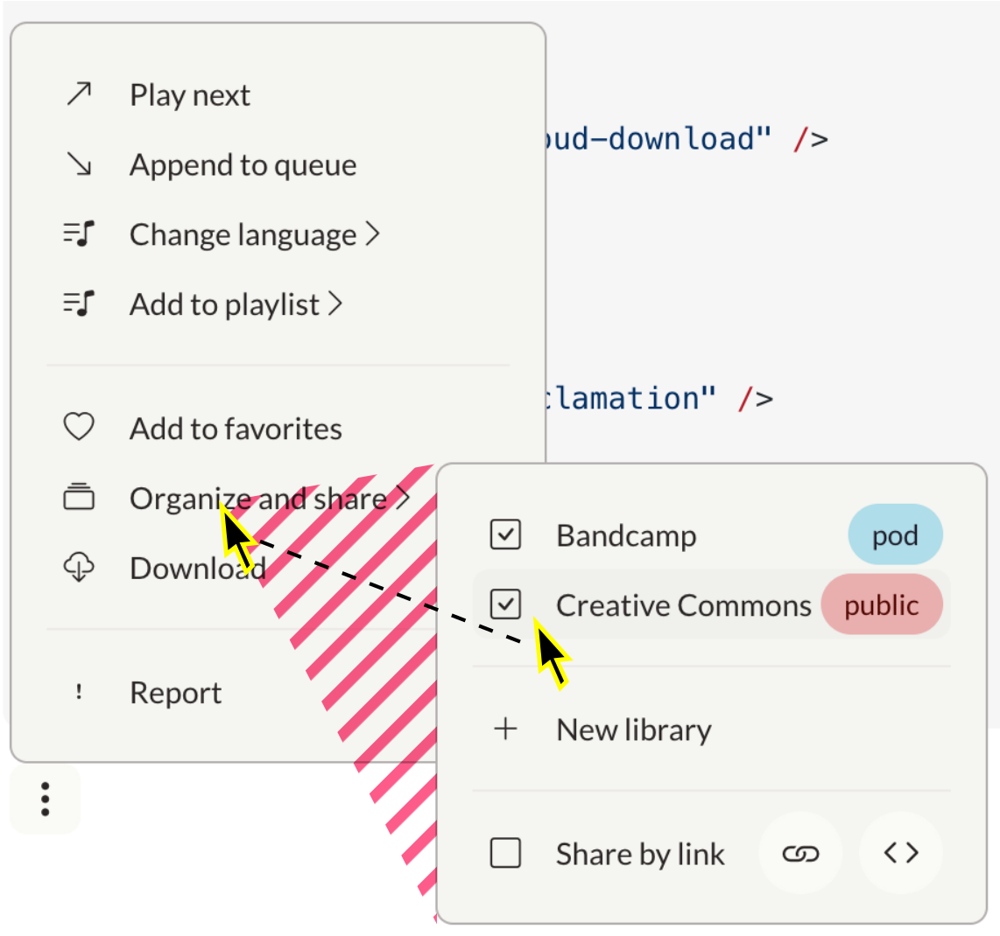

<script setup lang="ts">
import { ref } from 'vue'
import { SUPPORTED_LOCALES, setI18nLanguage } from '~/init/locale'

import Button from "~/components/ui/Button.vue"
import OptionsButton from "~/components/ui/button/Options.vue"
import Pill from "~/components/ui/Pill.vue"
import Popover from "~/components/ui/Popover.vue"
import PopoverCheckbox from "~/components/ui/popover/PopoverCheckbox.vue"
import PopoverItem from "~/components/ui/popover/PopoverItem.vue"
import PopoverRadio from "~/components/ui/popover/PopoverRadio.vue"
import PopoverSubmenu from "~/components/ui/popover/PopoverSubmenu.vue"
import Toggle from "~/components/ui/Toggle.vue"

// String values

const privacyChoices = ['public', 'private', 'pod']
const bcPrivacy = ref('pod')
const ccPrivacy = ref('public')

// Boolean values

const bc = ref(false)
const cc = ref(false)
const share = ref(false)

// Alert control

const alert = (message: string) => window.alert(message)

// Menu controls

const emptyMenu = ref(false)
// const separator = ref(false)
const singleItemMenu = ref(false)
const checkboxMenu = ref(false)
const radioMenu = ref(false)
const seperatorMenu = ref(false)
const subMenu = ref(false)
const extraItemsMenu = ref(false)
const linksMenu = ref(false)
const fullMenu= ref(false)
const isOpen = ref(false)
const keepOpen = ref(false)
</script>

```ts
import Popover from "~/components/ui/Popover.vue"
```

# Popover (Dropdown Menu)

Popovers (`Popover`) are dropdown menus activated by a button. Use popovers to create dropdown menus ranging from simple lists to complex nested menus.

::: warning A11y issues

This component has severe usability issues and cannot be used as-is.

### Add keyboard operability

> I can't operate the popup with a keyboard. Remove barrier for people not using a mouse.

- ✅ All items can be focused and activated by `Space`
  (use `<button>` element instead of `<div>`)

- **Tab order:** Users can go to the next and previous items with `Tab` and `Shift+Tab`. When they have opened a sub-menu, the next focusable element is inside the sub-menu. When they have closed it, the focus jumps back to where it was.

- **Dismissal:** Users can close a menu or sub-menu with `ESC`

- **Arrow keys:** Users can move up and down a menu, open sub-menus with `->` and close them with `<-`. I have added something like this to `Tabs.vue`, for reference.

### Implement expected behavior

> Switching to submenus is error-prone. When moving cursor into freshly opened submenu, it should not close if the cursor crosses another menu item.



- **Dead triangle:** Add a triangular invisible node that covers the possible paths from the current mouse position to the menu items.

---

> Large menus disappear. I can't scroll to see all options.

- **Submenu-to-Modal:** Lists longer than 12 or so items are not recommended and should be replaced with modals.

---

> Submenus open without a delay, and they don't close unless I click somewhere outside them, which goes against established expectations.

- **Expansion delay:** Sub-menus open after 200ms

- **Auto-close:** Sub-menus close when the outside is hovered. There may be a delay of 200ms. Menus close when they lose focus.

---

Common UI libraries in the Vue ecosystem such as vuetify or shadcn-vue all implement these features. It may be prudent to use their components.

::: tip Quick mitigation tactics:

- Place complex interfaces into nested [`Modal`](./modal)s
- Place long lists into [native `<Select>` elements](https://developer.mozilla.org/en-US/docs/Web/HTML/Element/select)
- Avoid sub-menus

:::

Common uses:

- "More actions" dropdown menus
- Navigation menus
- Settings menus
- Context menus (right-click menus)

| Prop   | Data type | Required? | Description                                                |
| ------ | --------- | --------- | ---------------------------------------------------------- |
| `open` | Boolean   | No        | Controls whether the popover is open. Defaults to `false`. |

[[toc]]

```vue-html
<Popover>
  <template #default="{ toggleOpen }">
    <OptionsButton @click="toggleOpen" />
  </template>
</Popover>
```

<Popover>
  <template #default="{ toggleOpen }">
    <OptionsButton @click="toggleOpen" />
  </template>
</Popover>

Destructure the function `toggleOpen` and let
a [default dropdown button: `OptionsButton`](./button/options.md) trigger it. This way, the state of the component is encapsulated.

## Bind to `isOpen`

If you want to process or influence the expansion of the menu in the containing component, you can bind it to a `ref`.

Use [Vue event handling](https://vuejs.org/guide/essentials/event-handling.html) to map the button to a boolean value.

```vue{7}
<script setup lang="ts">
  const isOpen = ref(false)
</script>

<template>
  <Popover v-model="isOpen">
    <OptionsButton @click="isOpen = !isOpen" />
  </Popover>
</template>
```

<Popover v-model="emptyMenu">
  <OptionsButton @click="emptyMenu = !emptyMenu" />
</Popover>

## Customize the dropdown button

```vue
<script setup lang="ts">
const open = ref(false);
const privacyChoices = ["pod", "public", "private"];
const bcPrivacy = ref("pod");
</script>

<template>
  <Popover v-model="isOpen">
    <template #default="{ toggleOpen }">
      <Pill
        @click="
          (e) => {
            console.log('Pill clicked');
            console.log('Before toggleOpen:', isOpen);
            toggleOpen();
            console.log('After toggleOpen:', isOpen);
          }
        "
        :blue="bcPrivacy === 'pod'"
        :red="bcPrivacy === 'public'"
      >
        {{ bcPrivacy }}
      </Pill>
    </template>
    <template #items>
      <PopoverRadio v-model="bcPrivacy" :choices="privacyChoices" />
    </template>
  </Popover>
</template>
```

<Popover v-model="isOpen">
  <template #default="{ toggleOpen }">
    <Pill
    @click="() => {
      console.log('Pill clicked');
      console.log('Before toggleOpen:', isOpen);
      toggleOpen();
      console.log('After toggleOpen:', isOpen);
    }"
      :blue="bcPrivacy === 'pod'"
      :red="bcPrivacy === 'public'"
    >
      {{ bcPrivacy }}
    </Pill>
  </template>
  <template #items>
    <PopoverRadio v-model="bcPrivacy" :choices="privacyChoices" />
  </template>
</Popover>

## Keep the popover open

By default, the popover closes when a radiobutton, link, or other item is chosen. The exception is with checkboxes because the user can select multiple options. Override the default behavior by setting the `keep-open` prop on any of the following components:

- `<PopoverRadio>` - keep the popover open when any radio item is selected
- `<PopoverRadioItem>` - keep the popover open when a specific radio item is selected
- `<PopoverItem>` - keep the popover open when the link or button is activated
- `<Popover>` - keep the popover open when any item is selected (clicking outside the popover still closes it)

```vue
<Popover v-model="keepOpen">
  <Toggle v-model="keepOpen" label="Show privacy controls" />
  <template #items>
    <PopoverRadio v-model="bcPrivacy" :choices="privacyChoices" keep-open />
  </template>
</Popover>
```

<Popover v-model="keepOpen">
  <Toggle v-model="keepOpen" label="Show privacy controls" />
  <template #items>
    <PopoverRadio v-model="bcPrivacy" :choices="privacyChoices" keep-open />
  </template>
</Popover>

## Items

Popovers contain a list of menu items. Items can contain different information based on their type.

::: info
Lists of items must be nested inside a `<template #items>` tag directly under the `<Popover>` tag.
:::

### Popover item

The popover item (`PopoverItem`) is a simple button that uses [Vue event handling](https://vuejs.org/guide/essentials/event-handling.html). Each item contains a [slot](https://vuejs.org/guide/components/slots.html) which you can use to add a menu label and icon.

```vue{10-13}
<script setup lang="ts">
  const alert = (message: string) => window.alert(message)
  const open = ref(false)
</script>

<template>
  <Popover v-model="open">
    <OptionsButton @click="open = !open" />
    <template #items>
      <PopoverItem @click="alert('Report this object?')">
        <i class="bi bi-exclamation" />
        Report
      </PopoverItem>
    </template>
  </Popover>
</template>
```

<Popover v-model="singleItemMenu">
  <OptionsButton @click="singleItemMenu = !singleItemMenu" />
  <template #items>
    <PopoverItem @click="alert('Report this object?')">
      <i class="bi bi-exclamation" />
      Report
    </PopoverItem>
  </template>
</Popover>

### Checkbox

The checkbox (`PopoverCheckbox`) is an item that acts as a selectable box. Use [`v-model`](https://vuejs.org/api/built-in-directives.html#v-model) to bind the checkbox to a boolean value. Each checkbox contains a [slot](https://vuejs.org/guide/components/slots.html) which you can use to add a menu label.

```vue{11-16}
<script setup lang="ts">
const bc = ref(false)
const cc = ref(false)
const open = ref(false)
</script>

<template>
  <Popover v-model="open">
    <OptionsButton @click="open = !open" />
    <template #items>
      <PopoverCheckbox v-model="bc">
        Bandcamp
      </PopoverCheckbox>
      <PopoverCheckbox v-model="cc">
        Creative commons
      </PopoverCheckbox>
    </template>
  </Popover>
</template>
```

<Popover v-model="checkboxMenu">
  <OptionsButton @click="checkboxMenu = !checkboxMenu" />
  <template #items>
    <PopoverCheckbox v-model="bc">
      Bandcamp
    </PopoverCheckbox>
    <PopoverCheckbox v-model="cc">
      Creative commons
    </PopoverCheckbox>
  </template>
</Popover>

### Radio

The radio (`PopoverRadio`) is an item that acts as a radio selector.

| Prop         | Data type       | Required? | Description                                                                                                                      |
| ------------ | --------------- | --------- | -------------------------------------------------------------------------------------------------------------------------------- |
| `modelValue` | String          | Yes       | The current value of the radio. Use [`v-model`](https://vuejs.org/api/built-in-directives.html#v-model) to bind this to a value. |
| `choices`    | Array\<String\> | Yes       | A list of choices.                                                                                                               |

```vue
<script setup lang="ts">
const open = ref(false);
const currentChoice = ref("pod");
const privacy = ["public", "private", "pod"];
</script>

<template>
  <Popover v-model="open">
    <OptionsButton @click="open = !open" />
    <template #items>
      <PopoverRadio v-model="currentChoice" :choices="choices" />
    </template>
  </Popover>
</template>
```

<Popover v-model="radioMenu">
  <OptionsButton @click="radioMenu = !radioMenu" />
    <template #items>
      <PopoverRadio v-model="bcPrivacy" :choices="privacyChoices"/>
    </template>
</Popover>

### Separator

Use a standard horizontal rule (`<hr>`) to add visual separators to popover lists.

```vue{14}
<script setup lang="ts">
const bc = ref(false)
const cc = ref(false)
const open = ref(false)
</script>

<template>
  <Popover v-model="open">
    <OptionsButton @click="open = !open" />
    <template #items>
      <PopoverCheckbox v-model="bc">
        Bandcamp
      </PopoverCheckbox>
      <hr>
      <PopoverCheckbox v-model="cc">
        Creative commons
      </PopoverCheckbox>
    </template>
  </Popover>
</template>
```

<Popover v-model="seperatorMenu">
  <OptionsButton @click="seperatorMenu = !seperatorMenu" />
  <template #items>
    <PopoverCheckbox v-model="bc">
      Bandcamp
    </PopoverCheckbox>
    <hr>
    <PopoverCheckbox v-model="cc">
      Creative commons
    </PopoverCheckbox>
  </template>
</Popover>

### Icon Prop

PopoverItem supports an `icon` prop to easily add icons to menu items. The icon prop accepts standard Bootstrap icon classes.

| Prop   | Data type | Required? | Description                                     |
| ------ | --------- | --------- | ----------------------------------------------- |
| `icon` | String    | No        | Bootstrap icon class to display before the item |

```vue-html
<PopoverItem icon="bi-music-note-list">
  Play next
</PopoverItem>

<PopoverItem icon="right bi-share">
  Share
</PopoverItem>
```

<Popover v-model="isOpen">
  <OptionsButton @click="isOpen = !isOpen" />
  <template #items>
    <PopoverItem icon="bi-music-note-list">
      Play next
    </PopoverItem>
    <PopoverItem icon="right bi-share">
      Share
    </PopoverItem>
  </template>
</Popover>
```

## Submenus

To create more complex menus, you can use submenus (`PopoverSubmenu`). Submenus are menu items which contain other menu items.

```vue{10-18}
<script setup lang="ts">
const bc = ref(false)
const isOpen = ref(false)
</script>

<template>
  <Popover v-model="isOpen">
    <OptionsButton @click="isOpen = !isOpen" />
    <template #items>
      <PopoverSubmenu>
        <i class="bi bi-collection" />
        Organize and share
        <template #items>
          <PopoverCheckbox v-model="bc">
            Bandcamp
          </PopoverCheckbox>
          <PopoverItem :to="{ name: 'learn-more' }">
              Learn more...
          </PopoverItem>
          <PopoverItem>Cancel</PopoverItem>
        </template>
      </PopoverSubmenu>
    </template>
  </Popover>
</template>
```

<Popover v-model="subMenu">
  <OptionsButton @click="subMenu = !subMenu" />
  <template #items>
    <PopoverSubmenu>
      <i class="bi bi-collection" />
      Organize and share
      <template #items>
        <PopoverCheckbox v-model="bc">
          Bandcamp
        </PopoverCheckbox>
        <PopoverItem to="https://docs.funkwhale.audio">
            Learn more...
        </PopoverItem>
        <PopoverItem>Cancel</PopoverItem>
      </template>
    </PopoverSubmenu>
  </template>
</Popover>

## Extra items

You can add extra items to the right hand side of a popover item by nesting them in a `<template #after>` tag. Use this to add additional menus or buttons to menu items.

```vue{18-29,34-37}
<script setup lang="ts">
const bc = ref(false)
const privacyChoices = ['public', 'private', 'pod']
const bcPrivacy = ref('pod')
const isOpen = ref(false)
</script>

<template>
  <Popover v-model="isOpen">
    <OptionsButton @click="isOpen = !isOpen" />
    <template #items>
      <PopoverSubmenu>
        <i class="bi bi-collection" />
        Organize and share
        <template #items>
          <PopoverCheckbox v-model="bc">
            Bandcamp
            <template #after>
              <Popover>
                <template #default="{ toggleOpen }">
                  <Pill @click.stop="toggleOpen" :blue="bcPrivacy === 'pod'" :red="bcPrivacy === 'public'">
                    {{ bcPrivacy }}
                  </Pill>
                </template>
                <template #items>
                  <PopoverRadio v-model="bcPrivacy" :choices="privacyChoices"/>
                </template>
              </Popover>
            </template>
          </PopoverCheckbox>
          <hr>
          <PopoverCheckbox v-model="share">
            Share by link
            <template #after>
              <Button ghost @click.stop="alert('Link copied to clipboard')" round icon="bi-link" />
              <Button ghost @click.stop="alert('Here is your code')" round icon="bi-code" />
            </template>
          </PopoverCheckbox>
        </template>
      </PopoverSubmenu>
    </template>
  </Popover>
</template>
```

<Popover v-model="extraItemsMenu">
  <OptionsButton @click="extraItemsMenu = !extraItemsMenu" />
  <template #items>
    <PopoverSubmenu>
      <i class="bi bi-collection" />
      Organize and share
      <template #items>
        <PopoverCheckbox v-model="bc">
          Bandcamp
          <template #after>
            <Popover>
              <template #default="{ toggleOpen }">
                <Pill @click.stop="toggleOpen" :blue="bcPrivacy === 'pod'" :red="bcPrivacy === 'public'">
                  {{ bcPrivacy }}
                </Pill>
              </template>
              <template #items>
                <PopoverRadio v-model="bcPrivacy" :choices="privacyChoices"/>
              </template>
            </Popover>
          </template>
        </PopoverCheckbox>
        <hr>
        <PopoverCheckbox v-model="share">
          Share by link
          <template #after>
            <Button @click.stop="alert('Link copied to clipboard')" secondary round icon="bi-link" />
            <Button @click.stop="alert('Here is your code')" secondary round icon="bi-code" />
          </template>
        </PopoverCheckbox>
      </template>
    </PopoverSubmenu>
  </template>
</Popover>

## Links

You can use `PopoverItem`s as Links by providing a `to` prop with the route object or and external Url (`http...`). Read more on the [Link component](./link) page.

<Popover v-model="linksMenu">
  <OptionsButton @click="linksMenu = !linksMenu" />
  <template #items>
    <PopoverItem to="a">
      <i class="bi bi-music-note-list" />
      Hello
    </PopoverItem>
    <PopoverSubmenu>
      <i class="bi bi-music-note-list" />
      Change language
      <template #items>
        <PopoverItem
          v-for="(language, key) in SUPPORTED_LOCALES"
          :key="key"
          :to="key"
        >
          <i class="bi bi-gear-fill" />
          {{ language }}
        </PopoverItem>
      </template>
    </PopoverSubmenu>
  </template>
</Popover>

## Menu

Here is an example of a completed menu containing all supported features.

```vue
<script setup lang="ts">
const isOpen = ref(false);
const bc = ref(false);
const cc = ref(false);
const share = ref(false);
const bcPrivacy = ref("pod");
const ccPrivacy = ref("public");
const privacyChoices = ["private", "pod", "public"];
</script>

<template>
  <Popover v-model="isOpen">
    <OptionsButton @click="isOpen = !isOpen" />
    <template #items>
      <PopoverSubmenu>
        <i class="bi bi-music-note-list" />
        Change language
        <template #items>
          <PopoverItem
            v-for="(language, key) in SUPPORTED_LOCALES"
            :key="key"
            @click="setI18nLanguage(key)"
          >
            {{ language }}
          </PopoverItem>
        </template>
      </PopoverSubmenu>
      <PopoverItem>
        <i class="bi bi-arrow-up-right" />
        Play next
      </PopoverItem>
      <PopoverItem>
        <i class="bi bi-arrow-down-right" />
        Append to queue
      </PopoverItem>
      <PopoverSubmenu>
        <i class="bi bi-music-note-list" />
        Add to playlist
        <template #items>
          <PopoverItem>
            <i class="bi bi-music-note-list" />
            Sample playlist
          </PopoverItem>
          <hr />
          <PopoverItem>
            <i class="bi bi-plus-lg" />
            New playlist
          </PopoverItem>
        </template>
      </PopoverSubmenu>
      <hr />
      <PopoverItem>
        <i class="bi bi-heart" />
        Add to favorites
      </PopoverItem>
      <PopoverSubmenu>
        <i class="bi bi-collection" />
        Organize and share
        <template #items>
          <PopoverCheckbox v-model="bc">
            Bandcamp
            <template #after>
              <Popover>
                <template #default="{ toggleOpen }">
                  <Pill
                    @click.stop="toggleOpen"
                    :blue="bcPrivacy === 'pod'"
                    :red="bcPrivacy === 'public'"
                  >
                    {{ bcPrivacy }}
                  </Pill>
                </template>
                <template #items>
                  <PopoverRadio v-model="bcPrivacy" :choices="privacyChoices" />
                </template>
              </Popover>
            </template>
          </PopoverCheckbox>
          <PopoverCheckbox v-model="cc">
            Creative Commons
            <template #after>
              <Popover v-model="isOpen">
                <template #default="{ toggleOpen }">
                  <Pill
                    @click="toggleOpen"
                    :blue="ccPrivacy === 'pod'"
                    :red="ccPrivacy === 'public'"
                  >
                    {{ ccPrivacy }}
                  </Pill>
                </template>
                <template #items>
                  <PopoverRadio v-model="ccPrivacy" :choices="privacyChoices" />
                </template>
              </Popover>
            </template>
          </PopoverCheckbox>
          <hr />
          <PopoverItem>
            <i class="bi bi-plus-lg" />
            New library
          </PopoverItem>
          <hr />
          <PopoverCheckbox v-model="share">
            Share by link
            <template #after>
              <Button @click.stop ghost round icon="bi-link" />
              <Button @click.stop ghost round icon="bi-code" />
            </template>
          </PopoverCheckbox>
        </template>
      </PopoverSubmenu>
      <PopoverItem>
        <i class="bi bi-cloud-download" />
        Download
      </PopoverItem>
      <hr />
      <PopoverItem>
        <i class="bi bi-exclamation" />
        Report
      </PopoverItem>
    </template>
  </Popover>
</template>
```

<Popover v-model="fullMenu">
  <OptionsButton @click="fullMenu = !fullMenu" />
  <template #items>
    <PopoverItem>
      <i class="bi bi-arrow-up-right" />
      Play next
    </PopoverItem>
    <PopoverItem>
      <i class="bi bi-arrow-down-right" />
      Append to queue
    </PopoverItem>
    <PopoverSubmenu>
      <i class="bi bi-music-note-list" />
      Change language
      <template #items>
        <PopoverItem v-for="(language, key) in SUPPORTED_LOCALES"
        :key="key"
        @click="setI18nLanguage(key)" >
          {{ language }}
        </PopoverItem>
      </template>
    </PopoverSubmenu>
    <PopoverSubmenu>
      <i class="bi bi-music-note-list" />
      Add to playlist
      <template #items>
        <PopoverItem>
          <i class="bi bi-music-note-list" />
          Sample playlist
        </PopoverItem>
        <hr>
        <PopoverItem>
          <i class="bi bi-plus-lg" />
          New playlist
        </PopoverItem>
      </template>
    </PopoverSubmenu>
    <hr>
    <PopoverItem>
      <i class="bi bi-heart" />
      Add to favorites
    </PopoverItem>
    <PopoverSubmenu>
      <i class="bi bi-collection" />
      Organize and share
      <template #items>
        <PopoverCheckbox v-model="bc">
          Bandcamp
          <template #after>
            <Popover v-model="isOpen">
              <template #default="{ toggleOpen }">
                <Pill @click.stop="toggleOpen" :blue="bcPrivacy === 'pod'" :red="bcPrivacy === 'public'">
                  {{ bcPrivacy }}
                </Pill>
              </template>
              <template #items>
                <PopoverRadio v-model="bcPrivacy" :choices="privacyChoices"/>
              </template>
            </Popover>
          </template>
        </PopoverCheckbox>
        <PopoverCheckbox v-model="cc">
          Creative Commons
          <template #after>
            <Popover v-model="isOpen">
              <template #default="{ toggleOpen }">
                <Pill @click="toggleOpen" :blue="ccPrivacy === 'pod'" :red="ccPrivacy === 'public'">
                  {{ ccPrivacy }}
                </Pill>
              </template>
              <template #items>
                <PopoverRadio v-model="ccPrivacy" :choices="privacyChoices"/>
              </template>
            </Popover>
          </template>
        </PopoverCheckbox>
        <hr>
        <PopoverItem>
          <i class="bi bi-plus-lg" />
          New library
        </PopoverItem>
        <hr>
        <PopoverCheckbox v-model="share">
          Share by link
          <template #after>
            <Button @click.stop ghost round icon="bi-link" />
            <Button @click.stop ghost round icon="bi-code" />
          </template>
        </PopoverCheckbox>
      </template>
    </PopoverSubmenu>
    <PopoverItem>
      <i class="bi bi-cloud-download" />
      Download
    </PopoverItem>
    <hr>
    <PopoverItem>
      <i class="bi bi-exclamation" />
      Report
    </PopoverItem>
  </template>
</Popover>
