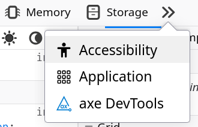

# Maintaining Accessibility

::: info Help improve the accessibility of Funkwhale!

Test the component examples below. Did you find a bug? A missing hint? Some component feature doesn't work as expected with your setup?

Get in touch on the Funkwhale [forum](https://forum.funkwhale.audio), [Matrix chat](https://matrix.to/#/#funkwhale-support:matrix.org), [Mattermost room](https://hub.funkwhale.audio) and [code forge](https://dev.funkwhale.audio).

:::

::: tip Recommended tools...

- **...for automated testing**

See [The W3C Web Accessibility Initiative's _Web Accessibility Evaluation Tools List_](https://www.w3.org/WAI/test-evaluate/tools/list/) for a comprehensive and well-curated list of advanced tools, especially for automated testing. These tools typically catch less than half the accessibility issues.

- **...for manual testing**

1. Screen readers

See [the MDN guide on Accessibility tooling and assistive technology](https://developer.mozilla.org/en-US/docs/Learn_web_development/Core/Accessibility/Tooling#what_screen_readers_are_available) for an overview of screen readers you can install, including Orca (on Linux), VoiceOver(on Macintosh), TalkBack (on Android) or NVDA (on Windows).

2. Other assistive technology

[MDN](https://developer.mozilla.org/en-US/docs/Learn_web_development/Core/Accessibility/Tooling#other_tooling) has a list of additional tooling that users typically use to access web apps such as Funkwhale. If you are using a braille keyboard, trackballs, joysticks, a touchpad, a screen magnifier, or voice commands, your critical feedback is very valuable to make funkwhale accessible.

3. Your browser's Developer Tools

If you use a desktop, laptop or tablet with a keyboard, you can usually open a pane or window with helpful tools by pressing F12 (or Fn+F12). Find the _Accessibility_ tab and follow the instructions there. In addition, the _Inspector_ tab helps you understand the hierarchical structure of the component's DOM nodes.

{width=180}

:::

**Components:**

[[TOC]]

## Form fields

**Using forms:** [Complete example](forms#accessible-forms)

- Using the Input component: [A11y checklist](components/ui/input#a11y-checklist)
- Using the Pills component: [A11y checklist](components/ui/pills#a11y-checklist)
- Using the Select component: [A11y checklist](components/ui/select#a11y-checklist)
- Using the Slider component: [A11y checklist](components/ui/slider#a11y-checklist)
- Using the Textarea component: [A11y checklist](components/ui/textarea#a11y-checklist)
- Using the Toggle component: [A11y checklist](components/ui/toggle#a11y-checklist)

<FormsA11y />

::: details Criterion 1.3.1d - Info and relationships - Form fields

**Goal**

Form fields must be properly labeled and grouped to ensure users can understand their purpose and relationship.

**How to test**

1. Use a screen reader to navigate through the form
2. Check that each form control announces its label and purpose
3. For groups of related controls (radio buttons, checkboxes), verify they are properly grouped and have a group label

**Expected outcome**

- Each form control announces its label
- Related controls are grouped with a common label
- Required fields are clearly indicated
- Error messages are associated with their fields

Learn more:
[Practical guide](https://accessibility.education.gov.uk/guidelines/wcag/explorer#1-3-1d) -
[Deep dive](https://www.w3.org/WAI/WCAG22/Understanding/info-and-relationships.html)
:::

::: details Criterion 1.3.5 - Identify input purpose

**Goal**

Form fields collecting user information should have their purpose programmatically identified to support autocomplete and other assistive features.

**How to test**

1. Check the HTML of input fields using browser developer tools
2. Look for appropriate autocomplete attributes
3. Try using browser autofill features

**Expected outcome**

- Input fields have appropriate autocomplete attributes
- Browser autofill correctly identifies field purposes
- Screen readers announce the purpose of each field

Learn more:
[Practical guide](https://accessibility.education.gov.uk/guidelines/wcag/explorer#1-3-5) -
[Deep dive](https://www.w3.org/WAI/WCAG22/Understanding/identify-input-purpose.html)
:::

::: details Criterion 2.5.3 - Label in name

**Goal**

Visual labels must match their programmatic names.

**How to test**

1. Compare visible labels to aria-label values
2. Use screen reader to check announced names
3. Try voice activation using visible labels

**Expected outcome**

- Visible labels match programmatic names
- Screen reader announces correct labels
- Voice commands using visible text work

Learn more:
[Practical guide](https://accessibility.education.gov.uk/guidelines/wcag/explorer#2-5-3) -
[Deep dive](https://www.w3.org/WAI/WCAG22/Understanding/label-in-name.html)
:::

::: details Criterion 3.3.1 - Error Identification

**Goal**

Form errors must be clearly identified and described to users.

**How to test**

1. Submit form with invalid data
2. Check how errors are displayed
3. Use screen reader to verify error announcements

**Expected outcome**

- Errors are clearly marked visually
- Error messages are associated with their fields
- Screen reader announces errors when they occur

Learn more:
[Practical guide](https://accessibility.education.gov.uk/guidelines/wcag/explorer#3-3-1) -
[Deep dive](https://www.w3.org/WAI/WCAG22/Understanding/error-identification.html)
:::

::: details Criterion 3.3.2 - Labels or Instructions

**Goal**

Form fields must have clear labels and instructions.

**How to test**

1. Review all form fields for visible labels
2. Check for instructions about required format
3. Verify label associations in the code

**Expected outcome**

- All fields have visible labels
- Required formats are clearly indicated
- Labels are properly associated with controls

Learn more:
[Practical guide](https://accessibility.education.gov.uk/guidelines/wcag/explorer#3-3-2) -
[Deep dive](https://www.w3.org/WAI/WCAG22/Understanding/labels-or-instructions.html)
:::

::: details Criterion 3.3.3 - Error Suggestion

**Goal**

Error messages should suggest how to fix the problem.

**How to test**

1. Trigger various form errors
2. Review error message content
3. Verify suggestions are helpful and clear

**Expected outcome**

- Error messages explain what went wrong
- Suggestions for correction are provided
- Language is clear and helpful

Learn more:
[Practical guide](https://accessibility.education.gov.uk/guidelines/wcag/explorer#3-3-3) -
[Deep dive](https://www.w3.org/WAI/WCAG22/Understanding/error-suggestion.html)
:::

::: details Criterion 3.3.4 - Error Prevention for important information

**Goal**

When providing important or sensitive data, users need to be able to review and correct information before final submission, or review and revert erroneous submissions in hindsight.

**How to test**

1. Complete form with important information
2. Check for review step before submission
3. Verify ability to correct information

**Expected outcome**

- Data can be reviewed before submission
- Changes can be made during review
- Submissions can be reversed if needed

Learn more:
[Practical guide](https://accessibility.education.gov.uk/guidelines/wcag/explorer#3-3-4) -
[Deep dive](https://www.w3.org/WAI/WCAG22/Understanding/error-prevention-legal-financial-data.html)
:::

## Alert

Using this component: [A11y checklist](components/ui/alert#a11y-checklist) -
[Accessible Alert example](components/ui/alert#keep-your-alerts-accessible)

<AlertA11y />

::: details Criterion 4.1.2 - Name, Role, Value

**Goal**

UI components must communicate their name, role, and value to assistive technologies.

**How to test**

1. Use a screen reader to interact with both alert variants
2. Check that the alert type (status vs. alert) is properly announced
3. Verify that the alert content is read when it appears

**Expected outcome**

- Screen reader announces the alert's role ('status' or 'alert')
- Alert content is automatically announced when it appears
- Users understand the difference between status and alert roles

Learn more:
[Practical guide](https://accessibility.education.gov.uk/guidelines/wcag/explorer#4-1-2) -
[Deep dive](https://www.w3.org/WAI/WCAG22/Understanding/name-role-value.html)
:::

::: details Criterion 4.1.3 - Status Messages

**Goal**

Status messages must be programmatically determined and announced without receiving focus.

**How to test**

1. Trigger different types of alerts
2. Use screen reader to verify automatic announcements
3. Check that focus remains unchanged when alerts appear

**Expected outcome**

- Status changes are announced automatically
- Alerts don't disrupt user's focus
- Different types of status messages are properly differentiated

Learn more:
[Practical guide](https://accessibility.education.gov.uk/guidelines/wcag/explorer#4-1-3) -
[Deep dive](https://www.w3.org/WAI/WCAG22/Understanding/status-messages.html)
:::

## Button

Using this component: [A11y checklist](components/ui/button#a11y-checklist) -
[Accessible Button example](components/ui/button#keep-your-buttons-accessible)

<ButtonA11y flex />

::: details Criterion 1.1.1 Non-text content

**Goal**

Buttons with icons must provide text alternatives that describe their purpose.

**How to test**

1. Use a screen reader on the button with icons but no visible text
2. Verify the announced label matches the button's function

**Expected outcome**

- Screen reader announces label for the icon-only button
- The announced label clearly indicates the button's purpose

Learn more:
[Practical guide](https://accessibility.education.gov.uk/guidelines/wcag/explorer#1-1-1) -
[Deep dive](https://www.w3.org/WAI/WCAG22/Understanding/non-text-content.html)
:::

::: details Criterion 2.1.1 - Keyboard accessible

**Goal**

All button functionality must be operable with a keyboard.

**How to test**

1. Tab to focus a button
2. Press Enter or Space repeatedly

**Expected outcome**

- Button is focusable with Tab
- Both Enter and Space activate the button
- The first button triggers an action
- The second button toggles between on and off

Learn more:
[Practical guide](https://accessibility.education.gov.uk/guidelines/wcag/explorer#2-1-1) -
[Deep dive](https://www.w3.org/WAI/WCAG22/Understanding/keyboard.html)
:::

::: details Criterion 2.4.7 - Focus visible

**Goal**

Button must have a visible focus indicator when navigating with keyboard.

**How to test**

1. Use Tab key to navigate to the button
2. Check if focus indicator is clearly visible
3. Verify focus indicator has sufficient contrast

**Expected outcome**

- Focus indicator is clearly visible
- Focus state has sufficient contrast with background
- Focus indicator persists while button has focus

Learn more:
[Practical guide](https://accessibility.education.gov.uk/guidelines/wcag/explorer#2-4-7) -
[Deep dive](https://www.w3.org/WAI/WCAG22/Understanding/focus-visible.html)
:::

::: details Criterion 2.5.8 - Target size (minimum)

**Goal**

Button must be large enough to be easily activated.

**How to test**

1. Check button dimensions
2. Try activating on touch devices
3. Verify spacing between adjacent buttons

**Expected outcome**

- Button target area is at least 24x24px
- Sufficient spacing between interactive elements
- Easy to activate without hitting adjacent elements

Learn more:
[Practical guide](https://accessibility.education.gov.uk/guidelines/wcag/explorer#2-5-8) -
[Deep dive](https://www.w3.org/WAI/WCAG22/Understanding/target-size-minimum.html)
:::

::: details Criterion 4.1.2 - Name, Role, Value

**Goal**

Button must communicate its name, role, and state to assistive technologies.

**How to test**

1. Use screen reader to focus on button
2. Check if button role is announced
3. Verify button label is announced
4. Test if state changes (pressed, disabled) are announced

**Expected outcome**

- Screen reader announces "button" role
- Button's label is clearly announced
- State changes are properly communicated

Learn more:
[Practical guide](https://accessibility.education.gov.uk/guidelines/wcag/explorer#4-1-2) -
[Deep dive](https://www.w3.org/WAI/WCAG22/Understanding/name-role-value.html)
:::

## Card

Using this component: [A11y checklist](components/ui/card#a11y-checklist) -
[Accessible Card example](components/ui/card#keep-your-cards-accessible)

<CardA11y flex level="h3" />

::: details Criterion 1.1.1 Non-text content

**Goal**

Images that convey information must have a text alternative

**How to test**

Use your screen reader on the image in the first card above

**Expected outcome**

The screen reader announces the image's alternative text: 'Colorful whales communicating in a network'

---

Learn more:
[Practical guide](https://accessibility.education.gov.uk/guidelines/wcag/explorer#1-1-1) -
[Deep dive](https://www.w3.org/WAI/WCAG22/Understanding/non-text-content.html)
:::

::: details Criterion 1.3.1c - Info and relationships - Headings

**Goal**

Where visual headings are used to communicate the structure of a page, they must also be communicated in a way that supports assistive technology users to access this structure.

**How to test**

Right-click on any heading and select the 'Inspect' option, or use a screen reader

**Expected outcome**

The Card title is marked up as a heading (`<h6>`)

Learn more:
[Practical guide](https://accessibility.education.gov.uk/guidelines/wcag/explorer#1-3-1c) -
[Deep dive](https://www.w3.org/WAI/WCAG22/Understanding/info-and-relationships.html)
:::

::: details Criterion 1.4.3 - Contrast minimum

**Goal**

There should be enough contrast between a background and the foreground content so that users can easily distinguish them.

**How to test**

Use a contrast checker tool to compare background and the foreground colors on text

**Expected outcome**

Text, including text in images, must have a contrast ratio of at least 4.5:1 against its background color. Large text can be 3:1.

Learn more:
[Practical guide](https://accessibility.education.gov.uk/guidelines/wcag/explorer#1-4-3) -
[Deep dive](https://www.w3.org/WAI/WCAG22/Understanding/contrast-minimum.html)

:::

::: details Criterion 1.4.11 - Non-text contrast

**Goal**

Visual elements used to indicate state or boundaries must have sufficient contrast.

**How to test**

1. Activate `:hover` and `:focus` states on the second card ("Link")
2. Use contrast checking tools to compare different interactive states
3. Use contrast checking tools to compare the icon color in the first card with its surrounding background color
4. Repeat in high contrast mode

**Expected outcome**

- Interactive states are clearly visible (3:1 contrast)
- Icon is clearly visible (3:1 contrast)
- Visual boundaries remain perceivable in high contrast mode

Learn more:
[Practical guide](https://accessibility.education.gov.uk/guidelines/wcag/explorer#1-4-11) -
[Deep dive](https://www.w3.org/WAI/WCAG22/Understanding/non-text-contrast.html)
:::

::: details Criterion 2.1.1 - Keyboard accessible

**Goal**

All functionality must be available using only a keyboard.

**How to test**

1. Navigate through cards using Tab key
2. Activate interactive elements using Enter (Inline link, Action link, Link card) or Space (Tag Button)
3. Verify all actions can be performed

**Expected outcome**

- All interactive elements are focusable
- Actions can be triggered with keyboard; no functionality requires mouse interaction

Learn more:
[Practical guide](https://accessibility.education.gov.uk/guidelines/wcag/explorer#2-1-1) -
[Deep dive](https://www.w3.org/WAI/WCAG22/Understanding/keyboard.html)
:::

::: details Criterion 2.4.3 - Focus order

**Goal**

Interactive elements must receive focus in an order that preserves meaning and operability.

**How to test**

1. Tab through card elements
2. Check if order matches visual layout

**Expected outcome**

- Focus moves logically through card content
- Focus sequence matches visual layout
- Focus movement is predictable

Learn more:
[Practical guide](https://accessibility.education.gov.uk/guidelines/wcag/explorer#2-4-3) -
[Deep dive](https://www.w3.org/WAI/WCAG22/Understanding/focus-order.html)
:::

::: details Criterion 2.4.7 - Focus visible

**Goal**

Keyboard focus indicator must be clearly visible.

**How to test**

1. Tab through interactive elements
2. Check contrast of focus indicators

**Expected outcome**

- Focus indicator is clearly visible; current focus location is always apparent
- Focus state has sufficient contrast (3:1)

Learn more:
[Practical guide](https://accessibility.education.gov.uk/guidelines/wcag/explorer#2-4-7) -
[Deep dive](https://www.w3.org/WAI/WCAG22/Understanding/focus-visible.html)
:::

::: details Criterion 2.5.2 - Pointer cancellation

**Goal**

Users must be able to cancel or undo pointer interactions with the card.

**How to test**

1. Start clicking/touching the link card but drag away before releasing
2. Start clicking/touching the link card but press Escape away before releasing

**Expected outcome**

- No actions triggered when pressing a mouse button
- Dragging away and pressing Enter cancel a click

Learn more:
[Practical guide](https://accessibility.education.gov.uk/guidelines/wcag/explorer#2-5-2) -
[Deep dive](https://www.w3.org/WAI/WCAG22/Understanding/pointer-cancellation.html)
:::

::: details Criterion 2.5.3 - Label in name

**Goal**

Visible labels must match their programmatic names for interactive elements within the card.

**How to test**

1. Use screen reader to check announced names
2. Compare with visible text labels
3. Try voice activation using visible labels

**Expected outcome**

- Screen reader announces same text as visible labels
- Programmatic names contain visible text
- Voice commands using visible text work

Learn more:
[Practical guide](https://accessibility.education.gov.uk/guidelines/wcag/explorer#2-5-3) -
[Deep dive](https://www.w3.org/WAI/WCAG22/Understanding/label-in-name.html)
:::

::: details Criterion 2.5.8 - Target size (minimum)

**Goal**

Interactive elements must be large enough to be easily activated.

**How to test**

1. Measure clickable areas
2. Try scrolling on touch devices by clicking on non-interactive surfaces
3. Check spacing between targets

**Expected outcome**

- Interactive elements are at least 24x24px
- There is sufficient spacing between targets so that users can scroll on touch devices
- Easy to activate on touch devices

Learn more:
[Practical guide](https://accessibility.education.gov.uk/guidelines/wcag/explorer#2-5-8) -
[Deep dive](https://www.w3.org/WAI/WCAG22/Understanding/target-size-minimum.html)
:::

## Header

Using this component: [A11y checklist](components/ui/layout/header#a11y-checklist) -
[Accessible Header example](components/ui/layout/header#accessible-header)

<HeaderA11y article />

::: details Criterion 2.4.3 - Focus order

**Goal**

Interactive elements must receive focus in an order that preserves meaning and operability.

**How to test**

1. Tab through action controls at the start of the header (next to the heading)
2. Check if order matches visual layout

**Expected outcome**

- Focus moves logically through actions and section content
- Focus sequence matches visual layout and movement is predictable

Learn more:
[Practical guide](https://accessibility.education.gov.uk/guidelines/wcag/explorer#2-4-3) -
[Deep dive](https://www.w3.org/WAI/WCAG22/Understanding/focus-order.html)
:::

See [Heading](#heading)

See [Section](#section)

## Heading

Using this component: [A11y checklist](components/ui/heading#a11y-checklist) -
[Accessible Heading example](components/ui/heading#accessible-heading)

<HeadingA11y/>

::: details Criterion 1.3.1c - Info and relationships - Headings

**Goal**

Headings must be properly structured and marked up to communicate document hierarchy.

**How to test**

1. Use a screen reader's heading navigation feature
2. Check heading levels in the browser's developer tools
3. Use a document outline tool

**Expected outcome**

- Headings are marked with appropriate h1-h6 tags
- Heading levels follow a logical hierarchy
- Screen readers announce the correct heading level

Learn more:
[Practical guide](https://accessibility.education.gov.uk/guidelines/wcag/explorer#1-3-1c) -
[Deep dive](https://www.w3.org/WAI/WCAG22/Understanding/info-and-relationships.html)
:::

## Input

Using this component: [A11y checklist](components/ui/input#a11y-checklist) -
[Accessible Input example](components/ui/input#accessible-input)

See [Form fields](#form-fields).

## Layout

Using this component: [A11y checklist](components/ui/layout#a11y-checklist) -
[Accessible Layout example](components/ui/layout#accessible-layout)

<LayoutA11y />

::: details Criterion 2.4.3 - Focus order

**Goal**

Interactive elements must receive focus in an order that preserves meaning and operability.

**How to test**

1. Tab through elements in each layout
2. Check if order matches visual layout

**Expected outcome**

- Focus moves logically through buttons
- Focus sequence matches visual layout and movement is predictable

Learn more:
[Practical guide](https://accessibility.education.gov.uk/guidelines/wcag/explorer#2-4-3) -
[Deep dive](https://www.w3.org/WAI/WCAG22/Understanding/focus-order.html)
:::

## Link

Using this component: [A11y checklist](components/ui/link#a11y-checklist) -
[Accessible Link example](components/ui/link#accessible-link)

<Layout article flex class="funkwhale default solid">
  <Link-a11y/>
</Layout>

::: details Criterion 1.1.1 Non-text content

**Goal**

Links with icons must provide text alternatives that describe their purpose.

**How to test**

1. Use a screen reader on links with icons but no visible text
2. Verify the announced label matches the link's destination

**Expected outcome**

- Screen reader announces meaningful labels for icon-only links
- The announced label clearly indicates where the link leads

Learn more:
[Practical guide](https://accessibility.education.gov.uk/guidelines/wcag/explorer#1-1-1) -
[Deep dive](https://www.w3.org/WAI/WCAG22/Understanding/non-text-content.html)
:::

::: details Criterion 2.1.1 - Keyboard accessible

**Goal**

All link functionality must be operable through a keyboard interface.

**How to test**

1. Tab to reach the link
2. Try to activate using Enter key

**Expected outcome**

- Link is focusable with Tab
- Enter activates the link

Learn more:
[Practical guide](https://accessibility.education.gov.uk/guidelines/wcag/explorer#2-1-1) -
[Deep dive](https://www.w3.org/WAI/WCAG22/Understanding/keyboard.html)
:::

::: details Criterion 2.4.7 - Focus visible

**Goal**

Link must have a visible focus indicator when navigating with keyboard.

**How to test**

1. Use Tab key to navigate to the link
2. Check if focus indicator is clearly visible and has sufficient contrast

**Expected outcome**

Focus indicator is clearly visible and has sufficient contrast with background

Learn more:
[Practical guide](https://accessibility.education.gov.uk/guidelines/wcag/explorer#2-4-7) -
[Deep dive](https://www.w3.org/WAI/WCAG22/Understanding/focus-visible.html)
:::

::: details Criterion 4.1.2 - Name, Role, Value

**Goal**

Link must communicate its name, role, and state to assistive technologies.

**How to test**

1. Use screen reader to focus on link
2. Check if link role is announced
3. Verify link destination is clear

**Expected outcome**

- Screen reader announces "link" role
- Link's destination is clearly conveyed
- State changes are properly communicated

Learn more:
[Practical guide](https://accessibility.education.gov.uk/guidelines/wcag/explorer#4-1-2) -
[Deep dive](https://www.w3.org/WAI/WCAG22/Understanding/name-role-value.html)
:::

## Loader

Using this component: [A11y checklist](components/ui/loader#a11y-checklist) -
[Accessible Loader example](components/ui/loader#accessible-loader)

<Layout article flex class="funkwhale default solid">
  <Loader-a11y/>
</Layout>

## Modal

Using this component: [A11y checklist](components/ui/modal#a11y-checklist) -
[Accessible Modal example](components/ui/modal#accessible-modal)

<Layout article flex class="funkwhale default solid">
  <Modal-a11y/>
</Layout>

::: details Criterion 1.4.13 - Content on Hover or Focus

**Goal**

Modal content must be dismissible, hoverable, and persistent.

**How to test**

1. Try to dismiss modal without moving focus
2. Move cursor over modal content
3. Check if content remains visible when needed

**Expected outcome**

- Can dismiss modal with Escape key
- Can move cursor over content without issues
- Content remains visible until deliberately dismissed

Learn more:
[Practical guide](https://accessibility.education.gov.uk/guidelines/wcag/explorer#1-4-13) -
[Deep dive](https://www.w3.org/WAI/WCAG22/Understanding/content-on-hover-or-focus.html)
:::

::: details Criterion 2.1.2 - No Keyboard Trap

**Goal**

Users must be able to navigate to and from all modal content using keyboard.

**How to test**

1. Open modal and navigate through all controls
2. Try to exit modal using keyboard
3. Verify focus handling when modal closes

**Expected outcome**

- Can navigate through all modal content
- Can exit modal with keyboard (Escape key)
- Focus returns to trigger element after closing

Learn more:
[Practical guide](https://accessibility.education.gov.uk/guidelines/wcag/explorer#2-1-2) -
[Deep dive](https://www.w3.org/WAI/WCAG22/Understanding/no-keyboard-trap.html)
:::

::: details Criterion 2.4.3 - Focus order

**Goal**

When a modal opens, focus should move into it and be trapped within until it closes.

**How to test**

1. Open the modal using both mouse and keyboard
2. Try tabbing through all focusable elements
3. Try to move focus outside the modal while it's open

**Expected outcome**

- Focus moves to modal when opened
- Focus is trapped within modal
- Focus returns to trigger element when closed

Learn more:
[Practical guide](https://accessibility.education.gov.uk/guidelines/wcag/explorer#2-4-3) -
[Deep dive](https://www.w3.org/WAI/WCAG22/Understanding/focus-order.html)
:::

::: details Criterion 4.1.2 - Name, Role, Value

**Goal**

The modal's role, state, and name must be properly communicated to assistive technologies.

**How to test**

1. Use a screen reader when opening/closing modal
2. Check ARIA attributes in your browser's developer tools

**Expected outcome**

- Screen reader announces modal role
- Modal state (open/closed) is announced
- Modal title is announced

Learn more:
[Practical guide](https://accessibility.education.gov.uk/guidelines/wcag/explorer#4-1-2) -
[Deep dive](https://www.w3.org/WAI/WCAG22/Understanding/name-role-value.html)
:::

## Nav

Using this component: [A11y checklist](components/ui/nav#a11y-checklist) -
[Accessible Nav example](components/ui/nav#accessible-nav)

<Layout article flex class="funkwhale default solid">
  <Nav-a11y/>
</Layout>

::: details Criterion 1.3.1 - Info and relationships

**Goal**

Ensure that the structure and relationships within the `Nav` component, especially when used as tabs, are programmatically determinable and presented in a way that preserves meaning.

**How to test**

Inspect the Nav component above using browser developer tools and accessibility inspectors as well as screen readers.
If used as tabs, verify the following: - The main container (`<Layout>`) has `role="tablist"`. - Individual tab elements (`<Button>`) have `role="tab"`. - Each tab has an `id` and an `aria-controls` attribute pointing to its corresponding tab panel's `id`. - Each tab panel (`<slot>`) has `role="tabpanel"` and an `aria-labelledby` attribute pointing to its corresponding tab's `id`. - `aria-posinset` and `aria-setsize` are correctly calculated and applied to each tab to convey its position within the set. - The `span` with class `falseTitle` uses `aria-hidden="true"` to hide duplicated or visually formatted text from screen readers.

**Expected outcome**

- Assistive technologies accurately announce the `Nav` component's structure, including tab lists, tabs, and their relationships to tab panels.
- Each tab title is only read out once by screen readers.

Learn more:
[Practical guide: 1.3.1](https://accessibility.education.gov.uk/guidelines/wcag/explorer#1-3-1) -
[Deep dive: Info and relationships](https://www.w3.org/WAI/WCAG22/Understanding/info-and-relationships.html)
:::

::: details Criterion 2.1.1 - Keyboard Accessible

**Goal**

Ensure that all functionality of the `Nav` component, particularly when used as tabs, is operable via a keyboard interface without requiring specific timings for individual keystrokes. Users should be able to navigate between tabs using standard keyboard interactions.

**How to test**

1.  Navigate to the `Nav` component using the `Tab` key.
2.  If used as tabs, once a tab is focused:
    - Press `ArrowRight` or `ArrowDown` to move focus to the next tab.
    - Press `ArrowLeft` or `ArrowUp` to move focus to the previous tab.
    - Press `Home` to move focus to the first tab.
    - Press `End` to move focus to the last tab.
    - Play around.
3.  Ensure that the tablist updates accordingly, and tab panel content associated with the selected tab is displayed.

**Expected outcome**

- Users can tab into and out of the tablist.
- Arrow keys move between tabs and wrap around ("roving").
- The currently focused tab is clearly indicated visually.
- Activating a tab displays its associated content.

Learn more:
[Practical guide: 2.1.1](https://accessibility.education.gov.uk/guidelines/wcag/explorer#2-1-1) -
[Deep dive: Keyboard Accessible](https://www.w3.org/WAI/WCAG22/Understanding/keyboard-accessible.html)
:::

::: details Criterion 2.4.8 - Location

**Goal**

Users should be able to determine their location within navigation.

**How to test**

Check for current location indicators:

- Screen readers should announce `aria-current="page"` for active navigation links.
- If used as tabs, screen readers should announce `aria-selected="true"` for the active tab.
- Sighted users can visually identify the active item (e.g., an orange line indicating the active tab or a highlighted nav-item).
- The target is highlighted.

**Expected outcome**

- The current location is clearly and consistently indicated for both sighted and assistive technology users.
- Screen readers accurately announce the current page/tab status.
- The navigation hierarchy and active state are easily understood.

Learn more:
[Practical guide: 2.4.8](https://accessibility.education.gov.uk/guidelines/wcag/explorer#2-4-8) -
[Deep dive: Location](https://www.w3.org/WAI/WCAG22/Understanding/location.html)
:::

::: details Criterion 4.1.2 - Name, Role, Value

**Goal**

Verify that all interactive components within the `Nav` component communicate their name, role, and state to assistive technologies.

**How to test**

1.  Inspect the component using browser developer tools and accessibility inspectors.
2.  If used as tabs, verify the following:
    - The `role="tab"` is correctly applied to tab elements.
    - The `aria-selected` attribute accurately reflects the active state of a tab (`true` for the selected tab, absent for unselected tabs).
3.  For all interactive elements (tabs and links), confirm that they have accessible (machine-readable) names.

**Expected outcome**

- Screen readers announce the correct roles for tabs and links.
- The accessible names for all interactive elements are clear and accurately convey their purpose.
- The state of tabs - selected, focused, current - is communicated to assistive technologies.

Learn more:
[Practical guide: 4.1.2](https://accessibility.education.gov.uk/guidelines/wcag/explorer#4-1-2) -
[Deep dive: Name, Role, Value](https://www.w3.org/WAI/WCAG22/Understanding/name-role-value.html)
:::

## Pagination

Using this component: [A11y checklist](components/ui/pagination#a11y-checklist) -
[Accessible Pagination example](components/ui/nav#accessible-pagination)

<Layout article flex class="funkwhale default solid">
  <Pagination-a11y/>
</Layout>

::: details Criterion 1.3.1b - Info and relationships - Lists

**Goal**

Navigation elements like pagination should use appropriate list markup to convey their structure.

**How to test**

1. Use a screen reader to navigate through the pagination controls
2. Check the HTML structure in the browser's developer tools

**Expected outcome**

- Pagination controls are structured in a list
- Screen reader announces the list structure
- Users can navigate between list items

Learn more:
[Practical guide: 1.3.1b](https://accessibility.education.gov.uk/guidelines/wcag/explorer#1-3-1b) -
[Deep dive: Info and relationships](https://www.w3.org/WAI/WCAG22/Understanding/info-and-relationships.html)
:::

::: details Criterion 1.3.1d - Info and relationships - Form fields

**Goal**

Assistive technology can understand what the page indicators mean.

**How to test**

Use a screen reader or your browser's inspection tools and navigate through the pagination controls.

**Expected outcome**

The current page number and total number of pages are clearly indicated.

Learn more:
[Practical guide](https://accessibility.education.gov.uk/guidelines/wcag/explorer#1-3-1d) -
[Deep dive: Info and relationships](https://www.w3.org/WAI/WCAG22/Understanding/info-and-relationships.html)
:::

## Pill

Using this component: [A11y checklist](components/ui/pill#a11y-checklist) -
[Accessible Pill example](components/ui/pill#accessible-pill)

See [Form fields](#form-fields).

## Pills

Using this component: [A11y checklist](components/ui/pills#a11y-checklist) -
[Accessible Pills example](components/ui/pills#accessible-pills)

See [Form fields](#form-fields).

## Popover

Using this component: [A11y checklist](components/ui/popover#a11y-checklist) -
[Accessible Popover example](components/ui/popover#accessible-popover)

<Layout article flex class="funkwhale default solid">
  <Popover-a11y/>
</Layout>

::: details Criterion 1.4.13 - Content on Hover or Focus

**Goal**

Popover content must be dismissible, hoverable, and persistent.

**How to test**

1. Open popover and try to dismiss it without moving focus
2. Move cursor over popover content
3. Check if content remains visible when hovering

**Expected outcome**

- Can dismiss popover with Escape key
- Can move cursor over content without it disappearing
- Content remains visible until deliberately dismissed

Learn more:
[Practical guide](https://accessibility.education.gov.uk/guidelines/wcag/explorer#1-4-13) -
[Deep dive](https://www.w3.org/WAI/WCAG22/Understanding/content-on-hover-or-focus.html)
:::

::: details Criterion 2.1.2 - No Keyboard Trap

**Goal**

Users must be able to navigate to and from popover content using keyboard.

**How to test**

1. Open popover and navigate through all controls
2. Try to exit popover using keyboard
3. Verify focus jumps back when popover closes

**Expected outcome**

- Can navigate through all popover content
- Can exit popover with keyboard (Escape key)
- Focus returns to trigger element after closing

Learn more:
[Practical guide](https://accessibility.education.gov.uk/guidelines/wcag/explorer#2-1-2) -
[Deep dive](https://www.w3.org/WAI/WCAG22/Understanding/no-keyboard-trap.html)
:::

::: details Criterion 2.4.3 - Focus order

**Goal**

When a popover opens, focus should move into it and be managed appropriately.

**How to test**

1. Open the popover using both mouse and keyboard
2. Tab through focusable elements
3. Close the popover using both mouse and keyboard

**Expected outcome**

- Focus moves to popover when opened
- Focus is properly managed within popover
- Focus returns to trigger when closed

Learn more:
[Practical guide: 2.4.3](https://accessibility.education.gov.uk/guidelines/wcag/explorer#2-4-3) -
[Deep dive: Info and relationships](https://www.w3.org/WAI/WCAG22/Understanding/focus-order.html)
:::

::: details Criterion 4.1.2 - Name, Role, Value

**Goal**

The popover's role, state, and name must be properly communicated to assistive technologies.

**How to test**

1. Use a screen reader when opening/closing popover
2. Check ARIA attributes in developer tools
3. Verify state changes are announced

**Expected outcome**

- Screen reader announces popover role
- Popover state (expanded/collapsed) is announced
- Content is properly labeled

Learn more:
[Practical guide](https://accessibility.education.gov.uk/guidelines/wcag/explorer#4-1-2) -
[Deep dive](https://www.w3.org/WAI/WCAG22/Understanding/name-role-value.html)
:::

## Section

Using this component: [A11y checklist](components/ui/layout/section#a11y-checklist) -
[Accessible Section example](components/ui/layout/section#accessible-section)

<SectionA11y article />

::: details Criterion 2.4.3 - Focus order

**Goal**

Interactive elements must receive focus in a predictable order.

**How to test**

1. Tab through Link near heading and the three linked cards
2. Check if order matches visual layout

**Expected outcome**

- Focus moves logically through actions and section content
- Focus sequence matches visual layout and movement is predictable

Learn more:
[Practical guide](https://accessibility.education.gov.uk/guidelines/wcag/explorer#2-4-3) -
[Deep dive](https://www.w3.org/WAI/WCAG22/Understanding/focus-order.html)
:::

See [Heading](#heading) for additional relevant criterion

## Select

Using this component: [A11y checklist](components/ui/select#a11y-checklist) -
[Accessible Select example](components/ui/select#accessible-select)

See [Form fields](#form-fields).

## Slider

Using this component: [A11y checklist](components/ui/slider#a11y-checklist) -
[Accessible Slider example](components/ui/slider#accessible-slider)

See [Form fields](#form-fields)

## Spacer

Using this component: [A11y checklist](components/ui/layout/spacer#a11y-checklist) -
[Accessible Spacer example](components/ui/layout/spacer#accessible-spacer)

<SpacerA11y />

See [Layout](#layout)

## Textarea

Using this component: [A11y checklist](components/ui/textarea#a11y-checklist) -
[Accessible Textarea example](components/ui/textarea#accessible-textarea)

See [Form fields](#form-fields)

## Toggle

Using this component: [A11y checklist](components/ui/toggle#a11y-checklist) -
[Accessible Toggle example](components/ui/toggle#accessible-toggle)

See [Form fields](#form-fields)

## Tabs

::: warning Deprecated component

This component is currently not used in the Funkwhale app. See [Nav for a full-featured, accessible alternative](#nav).

:::

Component documentation: [Tabs](components/ui/tabs)

## Table

Using this component: [A11y checklist](components/ui/layout/table#a11y-checklist) -
[Accessible Table example](components/ui/layout/table#accessible-table)

<Table-a11y/>

::: details Criterion 1.3.1a - Info and relationships - Tables

**Goal**

Data tables must use proper table markup to communicate their structure and relationships.

**How to test**

1. Use a screen reader's table navigation features
2. Check table markup in developer tools
3. Navigate between cells using keyboard

**Expected outcome**

- Table uses proper HTML table elements (table, th, td)
- Column and row headers are properly marked
- Screen reader announces table structure and headers

Learn more:
[Practical guide](https://accessibility.education.gov.uk/guidelines/wcag/explorer#1-3-1a) -
[Deep dive](https://www.w3.org/WAI/WCAG22/Understanding/info-and-relationships.html)
:::

## Toc

::: warning

This component is currently undergoing renovation. Check back later to test it when overhauled.

:::

Using this component: [A11y checklist](components/ui/toc#a11y-checklist) -
[Accessible TOC example](components/ui/toc#accessible-table)
