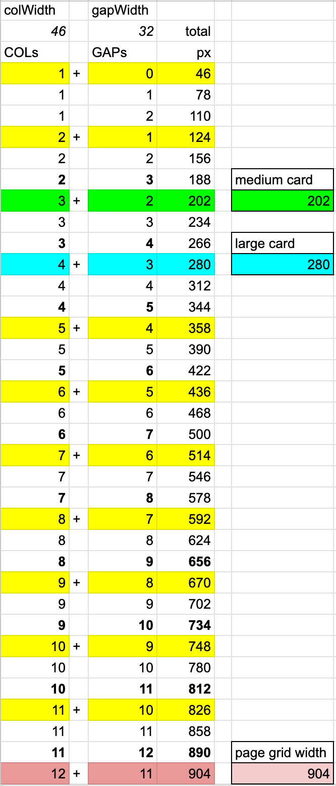

<script setup>
import Card from "~/components/ui/Card.vue"
import Button from "~/components/ui/Button.vue"
import Link from "~/components/ui/Link.vue"
import Layout from "~/components/ui/Layout.vue"
import Spacer from "~/components/ui/Spacer.vue";
</script>

<div id="is-overview-page" />

# Using widths and sizes

> [!NOTE]
> All interactive elements must be at least 24x24 pixels in size [so that users are able to click them](https://www.w3.org/WAI/WCAG22/Understanding/target-size-minimum.html).
> This library uses size primitives of 40px (small) and 48px (default) for all interactive elements.

## Add width via prop

<Layout flex class="preview" style="flex-grow: 1">

```vue-html
<Card min-content title='min-content' />
<Card tiny title='tiny' />
<Card buttonWidth title='buttonWidth' />
<Card small title='small' />
<Card medium title='medium' />
<Card auto title='auto' />
<Card width="170.5px" title='width=170.5px' />
<Card full title='full' />
```

  <Card min-content title='min-content' />
  <Card tiny title='tiny' />
  <Card buttonWidth title='buttonWidth' />
  <Card small title='small' />
  <Card medium title='medium' />
  <Card auto title='auto' />
  <Card width="170.5px" title='width=170.5px' />
  <Card full title='full' />
</Layout>

## Small height and square aspect ratio

<Layout grid class="preview">

<div style="grid-column: 1 / 7; grid-row: span 2">

```vue-html
<Button outline icon="bi-star"/>
<Button outline icon="bi-star large"/>
<Button outline square-small icon="bi-star" />
<Button outline square-small icon="bi-star large" />
<Button primary square >b</Button>
<Button primary >c</Button>
<Button primary square-small >a</Button>
<Button primary low-height >e</Button>
```

</div>

<Button outline icon="bi-star"/>
<Button outline icon="bi-star large"/>
<Spacer />
<Button outline square-small icon="bi-star" />
<Button outline square-small icon="bi-star large" />
<Spacer />
<Button primary square >b</Button>
<Button primary >c</Button>
<Spacer />
<Button primary square-small >a</Button>
<Button primary low-height >e</Button>

</Layout>
<Layout grid class="preview">

<div style="grid-column: -1 / -6; grid-row: span 4">

```vue-html
<Link icon="bi-star" to="https://funkwhale.audio"/>
<Link square-small icon="bi-star"  to="https://funkwhale.audio"/>
<Link square-small  to="https://funkwhale.audio">g</Link>
<Link square  to="https://funkwhale.audio">h</Link>
<Link  to="https://funkwhale.audio">i</Link>
<Link square-small  to="https://funkwhale.audio">j</Link>
<Link low-height  to="https://funkwhale.audio">k</Link>
<Link square low-height  to="https://funkwhale.audio">l</Link>
```

</div>

<Link icon="bi-star" to="https://funkwhale.audio"/>
<Link square-small icon="bi-star"  to="https://funkwhale.audio"/>
<Link square-small  to="https://funkwhale.audio">g</Link>
<Link square  to="https://funkwhale.audio">h</Link>
<Link  to="https://funkwhale.audio">i</Link>
<Link square-small  to="https://funkwhale.audio">j</Link>
<Link low-height  to="https://funkwhale.audio">k</Link>
<Link square low-height  to="https://funkwhale.audio">l</Link>

</Layout>

## Widths in the grid

::: details Default widths



:::

[Designing Pages — The grid](designing-pages#grid)
